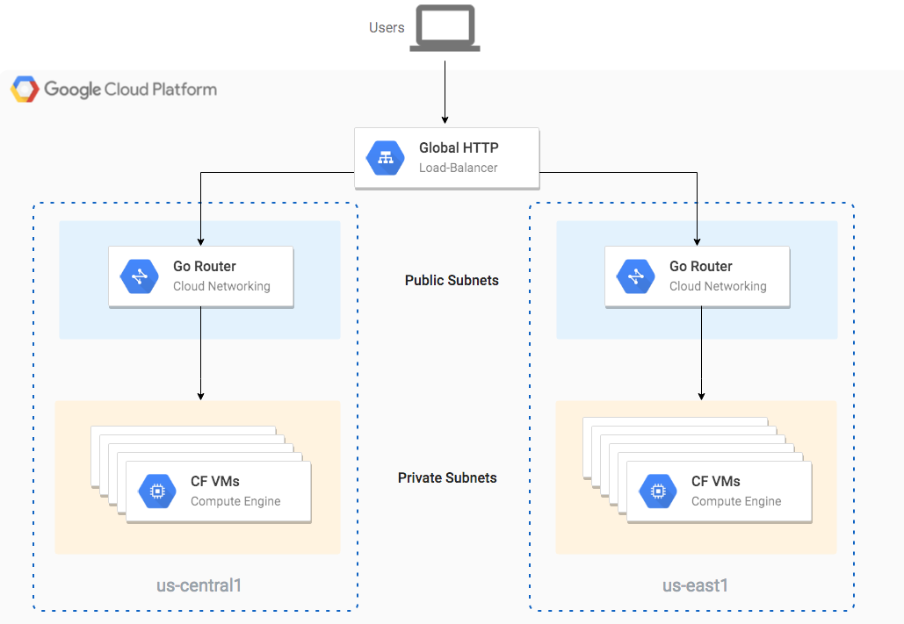

# Globally Redundant Cloud Foundry on Google Cloud

This repository has scripts and manifests for deploying Cloud Foundry in a
multi-region fashion.

**Note that you need at quota of at least 100 cores available us-central1 and
us-east regions in order to complete this tutorial**

## Installation

1. First edit the `central/bosh/deploy.sh` and `east/bosh/deploy.sh` scripts so
   that the `project` environment variable points to your Google Cloud project.

1. Change directories to `central/bosh`. Deploy a Bosh inception VM in the us-central1
   region by running:

   ./deploy.sh

1. Once that is complete run the same command in the `east/bosh` directory:

   ./deploy.sh

## Tear down

1. In order to tear down your deployment first delete all VMs in your project
   that start with `vm-` those are the ones created by your Bosh deployment.

2. Next go to the `east/bosh` directory and run the destroy script:

    ./destroy.sh

3. Finally do the same in the `central/bosh` directory:

    ./destroy.sh 
